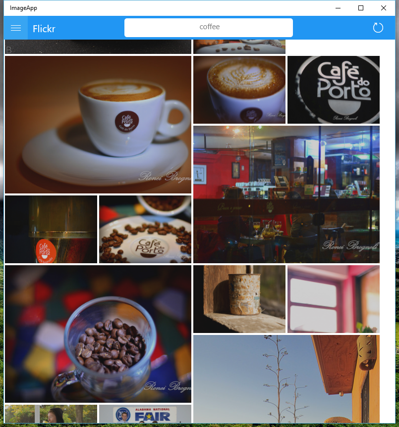

# ImageApp

  

“Using the Instagram API, create a Windows 10 Universal app that displays photos tagged with hashtag #selfie and arranges them using the pattern: big, small, small, big, small small, and repeat. Then implement one of the following features: Tap to enlarge, Drag and drop reordering, or Infinite scrolling. Scrolling should be smooth so performance is essential. Complete as much as you can within two days. Be creative and have fun. Good luck!”

-Infinite scrolling is working  
-Variable size images are working  
-View individual images on click is working  
-Drag and drop reordering is currently not implemented :(    

View images by tag for Instagram, Flickr, or Giphy!

  

Written by Dominic Barone
