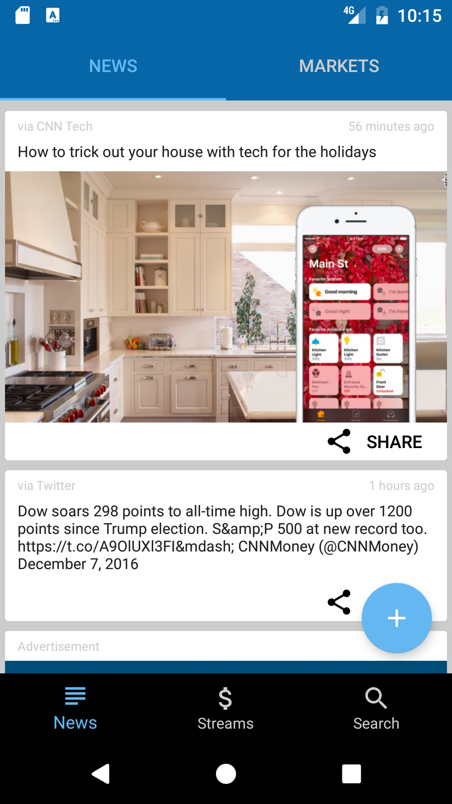
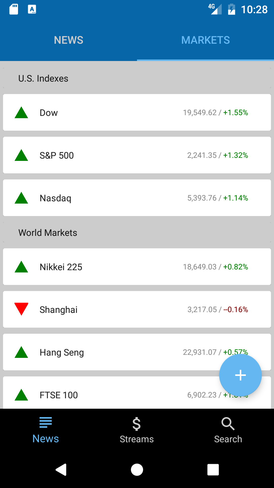

# CardStream App

  
  

Use this API endpoint:
 
https://api.cnnmoneystream.com/home_stream
 
Requirements:
• Use this API endpoint to create an activity that lists the json object data as a stream of cards.
• We heavily encourage you to use RecyclerView (but not an absolute requirement):
https://developer.android.com/reference/android/support/v7/widget/RecyclerView.html
https://developer.android.com/training/material/lists-cards.html

Due to lack of time, using SyncAdapter/SqLite/ContentProvider/CursorLoader has been skipped.
I have focused more on Customizing the UI to showcase the different cards.

Thanks,
Dominic
