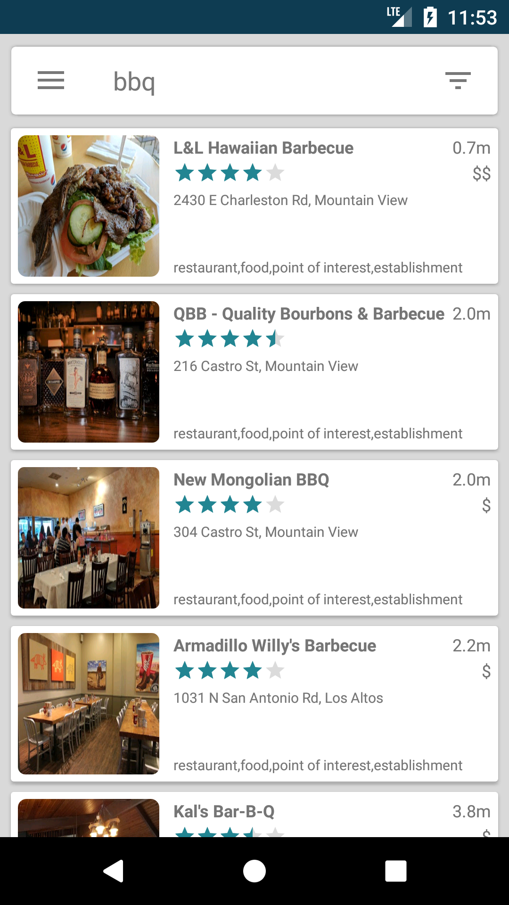
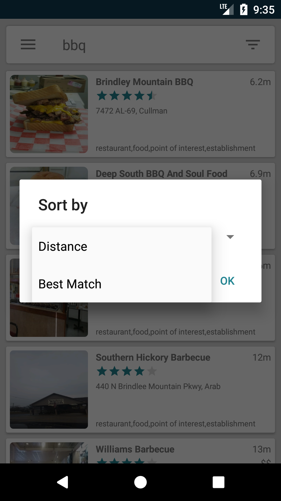
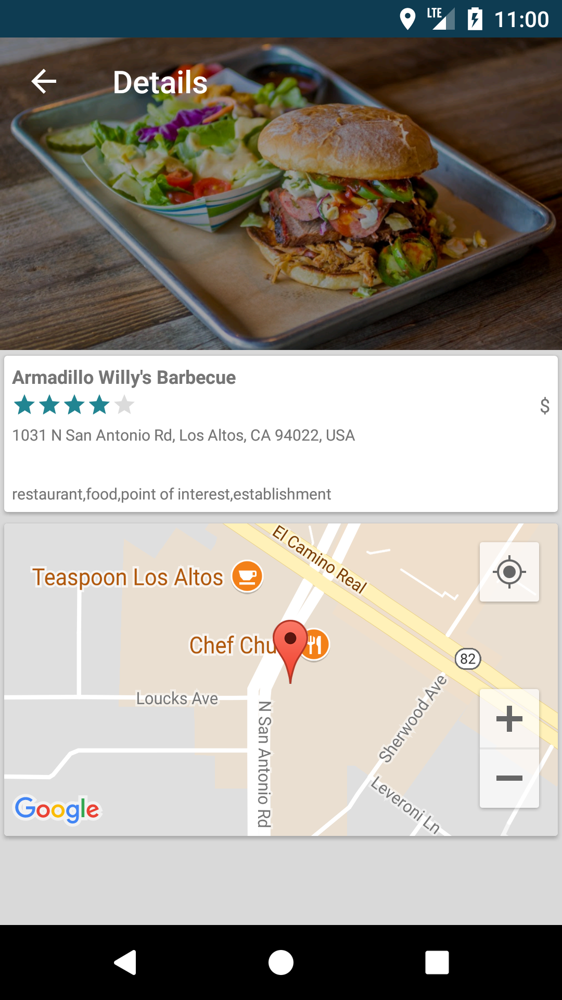

# lunch app

Requirements
------------
1. Use the [Google Places API](https://developers.google.com/places/web-service/intro).
2. A user should be presented with a list of restaurants based on the food type
and the location they enter.
3. A user should be able to sort the list by Best Match and Distance.
4. A user should be taken to a details page of the restaurant based on the restaurant
they select.
5. There should be a seperation between the data and view layer.
6. The app should be extensible. 

How the app was built
---------------------

For this app I think the requireements have been met. This app is written using an MVVM architecture pattern. This creates a good separation between business logic, ui logic and views. GSON is used for JSON deserialization. rxJava used for event interaction and threading. Android Architecture Components such as LiveData and ViewModel classes are used in the ViewModel layer.

A number of additional api's have been used:  
Google Places API  
Google Location Services (For location awareness used in search)  
GoogleMap was used to make mapping easier  

To persist http requests for Google Places API searches and details and make http requests easy to use I used another library written by me for such a purpose. This library uses OkHttp  
https://github.com/dfbarone/cachinghttp

Due to time constraints the FloatingSearchView is a View that was *not* written by myself.  
https://github.com/arimorty/floatingsearchview

Due to time constrains unit testing was not included for model classes.  

MainActivity / SearchFragment
---------------------
Uses LunchViewModel -> LunchModel (GooglePlacesApi/GooglePlayLocationManager)  

Note: When using this app in an emulator you may have to change your location setting to use 'High Accuracy' otherwise location services may not work. Go to: Settings -> Security & Location -> Location -> Choose Mode (High Accurary)  

  
  

DetailsActivity
---------------------
Uses LunchDetailViewModel -> LunchModel (GooglePlacesApi/GooglePlayLocationManager)  

Note: Images will scroll horizontally if there is more than one image for a given restaurant.  

  

