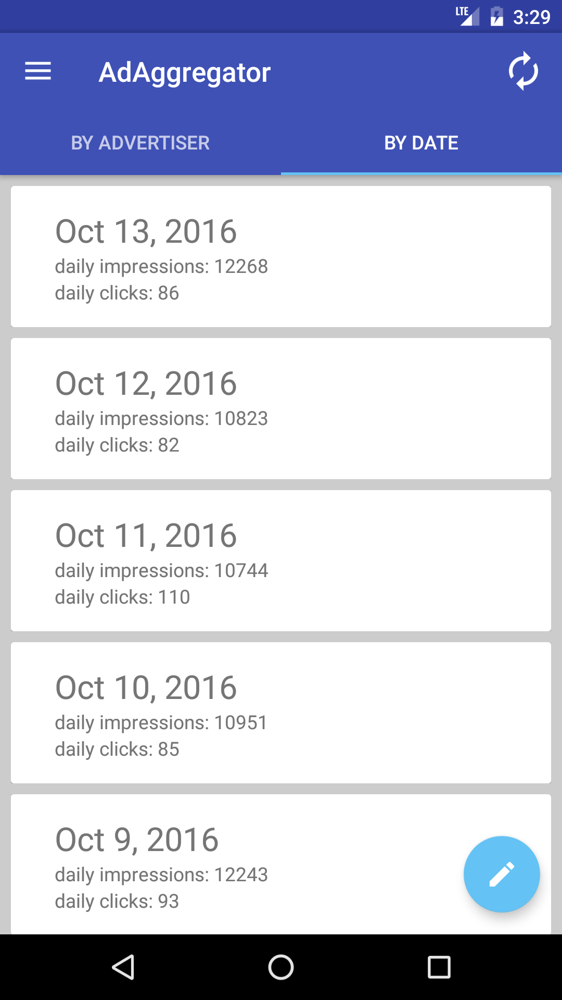

# AdAggregator

  

Our server has a URL endpoint that will return the performance (number of clicks and impressions) of a given advertiser over the past week (see JSON example below).

Create a Simple iOS or Android app that will do the following:

1. Create a UI that allows me enter to enter multiple advertiser ids 
Does not have to be very fancy but more elegant than a comma separated list
2. Have a submit button that on click will: 
Make all the needed API calls 
Render a table showing the impression and clicks aggregated by date for all the advertiser id�s submitted.
3. Bonus points if: 
You make the table sortable 
You update the table with data as the api calls come back 
Use concurrency and parallelization 
4. Style the app to your taste. 
 
Note: Take performance into consideration (eg a large number of advertiser id's will be submitted)

Sample JSON returned:  
[ 
 {"advertiser_id" : 123, "ymd" : "2014-09-20", "num_clicks" : 24, "num_impressions" : 1000}, 
 {"advertiser_id" : 123, "ymd" : "2014-09-21", "num_clicks" : 20, "num_impressions" : 1010}, 
 {"advertiser_id" : 123, "ymd" : "2014-09-22", "num_clicks" : 10, "num_impressions" : 1210}, 
 {"advertiser_id" : 123, "ymd" : "2014-09-23", "num_clicks" : 22, "num_impressions" : 1110}, 
 {"advertiser_id" : 123, "ymd" : "2014-09-24", "num_clicks" : 25, "num_impressions" : 1710}, 
 {"advertiser_id" : 123, "ymd" : "2014-09-25", "num_clicks" : 31, "num_impressions" : 1020}, 
 {"advertiser_id" : 123, "ymd" : "2014-09-26", "num_clicks" : 50, "num_impressions" : 2000} 
] 
